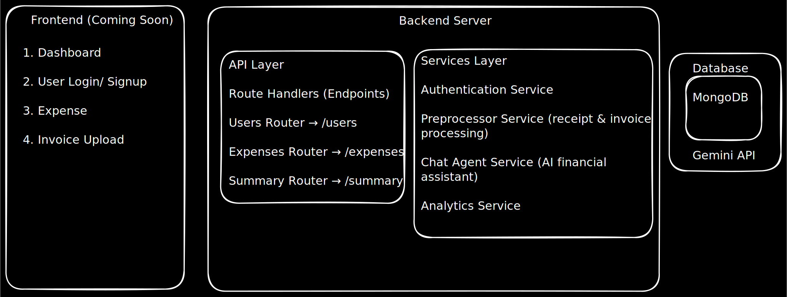

# 💰 Expense Manager

A comprehensive expense tracking and management system with AI-powered features for smarter financial management.

## 🌟 Features

- **📱 Frontend**
  - Modern, responsive React application with TypeScript
  - Beautiful green/black themed UI using shadcn/ui components
  - Interactive dashboard with charts and analytics
  - Mobile-friendly design with collapsible sidebar
  - Protected routes with JWT authentication
  - Real-time expense tracking and visualization

- **🔧 Backend**
  - RESTful API built with FastAPI
  - JWT-based authentication
  - AI-powered receipt processing
  - Intelligent expense categorization
  - Financial insights and analytics
  - AI chat assistant for financial advice

## 🏗️ Architecture



## 🚀 Quick Start

### Prerequisites

- Python 3.12+
- MongoDB (local or MongoDB Atlas)
- Google AI API key
- Node.js 20+ (for frontend, when available)

### Backend Setup

1. **Clone the repository**

   ```bash
   git clone https://github.com/Sanjeev-Kumar78/Expense_Manager.git
   cd Expense_Manager/backend
   ```

2. **Set up Python environment**

   ```bash
   # Create virtual environment
   python -m venv .venv

   # Activate virtual environment
   # Windows
   .venv\Scripts\activate
   # macOS/Linux
   source .venv/bin/activate
   ```

3. **Install dependencies**

   ```bash
   pip install -r requirements.txt
   ```

4. **Configure environment**

   ```bash
   # Copy environment template
   cp .env.example .env

   # Edit .env with your configuration
   # - MongoDB connection string
   # - Google AI API key
   # - JWT secret key
   ```

5. **Run the server**
   ```bash
   uvicorn main:app --reload
   ```

The API will be available at `http://localhost:8000`

### Frontend Setup

1. **Navigate to frontend directory**

   ```bash
   cd frontend
   ```

2. **Install dependencies**

   ```bash
   npm install
   ```

3. **Set up environment variables**

   ```bash
   echo "REACT_APP_API_URL=http://localhost:8000" > .env
   ```

4. **Start the development server**
   ```bash
   npm start
   ```

The frontend will be available at `http://localhost:3000`

## 📁 Project Structure

```
Expense_Manager/
├── README.md                 # This file
├── backend/                  # Backend API
│   ├── main.py              # FastAPI application entry point
│   ├── requirements.txt     # Python dependencies
│   ├── pyproject.toml       # Project configuration
│   ├── Dockerfile           # Docker configuration
│   ├── routes/              # API endpoints
│   │   ├── users.py         # User authentication & management
│   │   ├── expense_transactions.py # Expense & transaction management
│   │   └── summary.py       # Analytics & AI chat endpoints
│   ├── services/            # Business logic
│   │   ├── chat_agent.py    # AI financial assistant
│   │   └── preprocessor.py  # Receipt processing with AI
│   └── utils/               # Utilities
│       └── db.py            # Database operations
└── frontend/                # Frontend application
    ├── src/                 # Source code
    │   ├── components/      # Reusable UI components
    │   ├── pages/          # Page components
    │   ├── contexts/       # React contexts
    │   ├── utils/          # Utility functions
    │   └── types/          # TypeScript types
    ├── public/              # Static assets
    └── package.json         # Node.js dependencies
```

## 🔧 Backend API Overview

The backend provides a comprehensive RESTful API with the following main endpoints:

### 🔐 Authentication

- `POST /auth/register` - User registration
- `POST /auth/login` - User login
- `GET /auth/profile` - Get user profile
- `PUT /auth/profile` - Update user profile

### 💰 Expense Management

- `GET /expenses` - List user expenses
- `POST /expenses` - Create new expense
- `PUT /expenses/{id}` - Update expense
- `DELETE /expenses/{id}` - Delete expense
- `POST /expenses/receipt` - Process receipt with AI

### 📊 Analytics & Insights

- `GET /summary/spending` - Get spending summary
- `GET /summary/categories` - Category-wise breakdown
- `GET /summary/trends` - Spending trends
- `POST /summary/chat` - Chat with AI assistant

## 🤖 AI Features

### Receipt Processing

- **Upload receipts** as images (PNG, JPG) or PDFs
- **Automatic text extraction** using Google AI
- **Smart categorization** of expenses
- **Amount and merchant detection**

### Financial Assistant

- **Natural language queries** about your expenses
- **Personalized insights** based on spending patterns
- **Budget recommendations** and financial advice
- **Spending trend analysis**

## 🛠️ Technology Stack

### Backend

- **FastAPI** - Modern, fast web framework
- **MongoDB** - NoSQL database for flexible data storage
- **Google AI** - Advanced text processing and analysis
- **JWT** - Secure authentication
- **bcrypt** - Password hashing
- **Motor** - Async MongoDB driver

### Frontend (Completed ✅)

- **React/TypeScript** - Modern frontend framework with type safety
- **shadcn/ui** - High-quality, accessible component library
- **Tailwind CSS** - Utility-first CSS framework
- **Recharts** - Beautiful, responsive data visualization
- **React Router** - Client-side routing with protection
- **Axios** - HTTP client for API communication

## 🐳 Docker Support

The backend includes Docker support for easy deployment:

```bash
# Build the Docker image
docker build -t expense-manager-backend ./backend

# Run the container
docker run -p 8000:8000 expense-manager-backend
```

## 📝 API Documentation

Once the backend server is running, you can access:

- **Interactive API docs**: http://localhost:8000/docs
- **ReDoc documentation**: http://localhost:8000/redoc
- **OpenAPI schema**: http://localhost:8000/openapi.json

## 🤝 Contributing

1. Fork the repository
2. Create a feature branch (`git checkout -b feature/amazing-feature`)
3. Commit your changes (`git commit -m 'Add some amazing feature'`)
4. Push to the branch (`git push origin feature/amazing-feature`)
5. Open a Pull Request

## 📄 License

This project is licensed under the MIT License - see the [LICENSE](LICENSE) file for details.

## 🚧 Roadmap

### Phase 1: Backend (Current)

- ✅ Core API endpoints
- ✅ User authentication
- ✅ Expense management
- ✅ AI receipt processing
- ✅ Financial analytics
- ✅ AI chat assistant

### Phase 2: Frontend (Completed ✅)

- ✅ Responsive web interface with green/black theme
- ✅ Interactive dashboards with charts and analytics
- ✅ Real-time expense visualization
- ✅ Protected routes with JWT authentication
- ✅ Mobile-responsive design
- ✅ Modern React with TypeScript

### Phase 3: Advanced Features (Planned)

- 🔔 Smart notifications and alerts
- 📱 Mobile app (React Native)
- 🏦 Bank account integration
- 📊 Advanced reporting and exports
- 👥 Multi-user support for families
- 🎯 Goal setting and tracking

## 📞 Support

If you have any questions or need help, please:

1. Check the [documentation](./backend/README.md)
2. Search existing [issues](https://github.com/Sanjeev-Kumar78/Expense_Manager/issues)
3. Open a new [issue](https://github.com/Sanjeev-Kumar78/Expense_Manager/issues/new)

---

⭐ **Star this repository if you find it helpful!**
